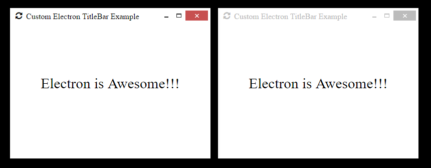

# electron-custom-titlebar-example

An example application for Electron that demonstrates a custom titlebar

## Screenshot

A montage of an active and inactive Electron window:

## How To Run

This requires Node to be installed on your machine:
[https://nodejs.org](https://nodejs.org)

- Clone this repository using Git
- Open command prompt
- Change to the directory you cloned the repository to
- `npm install`
- `cd frontend`
- `npm install`
- `npm run build`
- `cd ..`
- `npm run start`

## Author(s)

Frank Hale &lt;frankhale@gmail.com&gt;

## License

GNU GPL v3

## Date

30 April 2019
