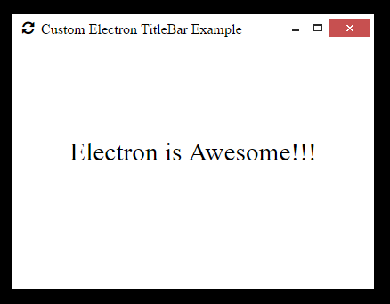

atom-shell-custom-titlebar-example
==================================

An example application for Atom-Shell that demonstrates a custom titlebar with icons

##Screenshot

##Author

Frank Hale &lt;frankhale@gmail.com&gt;

##Issues

There are known issues with icon hovers not changing as expected. This is more to do with Atom-Shell than anything. This is noticable sometimes when entering one of the window icons and then quickly moving into the draggable window titlebar area. Sometimes the icons are not aware that they should transition their hover icon.

##License

GNU GPL v3